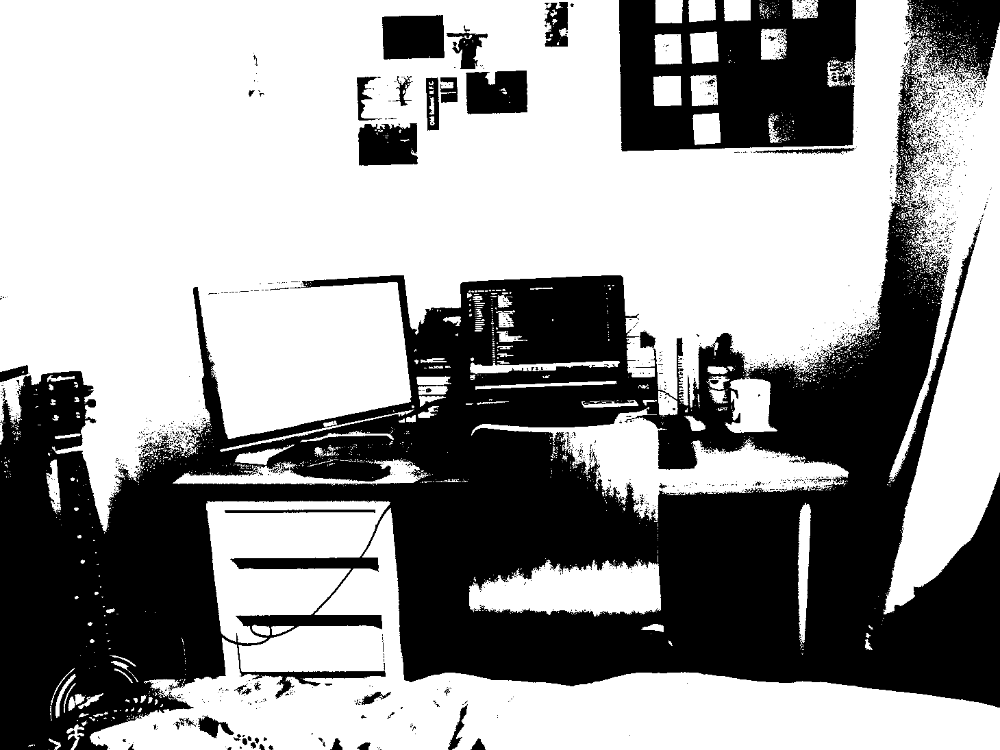
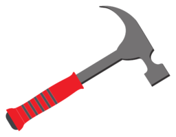

<!DOCTYPE html>
<html lang="en">
<head>
    <meta charset="UTF-8">
    <meta name="viewport" content="width=device-width, initial-scale=1.0">
    <link rel="stylesheet" href="./style.css">
    <title>Edward Stokes</title>
</head>

<body>
    <header class="header"> 

        

            

                <h2>Edward Stokes - Aspiring Web Developer</h2>
            

            <ul class="nav"> 
                <li><a href="#home">Home</a></li>
                <li><a href="#about">About Me</a></li>
                <li><a href="#projects">My Projects</a></li>
                <li><a href="#contact">Get In Touch</a></li>
            </ul>
        

    </header>

    

        

        

            

        

        

            
            

            

            

                <h1> Hi. &#128075 Nice to meet you!</h1>
                
My name is Ed, I'm a self-taught developer and you've arrived at my very first website.

            

            

                <figure>
                    
                    
                    <figcaption>Hover over the photo for a visualisation of my progress.</figcaption>
                </figure>    
            

            

                <h3>Find more below!</h3>
            

            
        

        

            

                <h2>The Details</h2>
                
 I began learning to program to make use of my free time during the first Covid lockdown.

                
 I started first by practicing challenges on Codewars in Python before enrolling on a pilot course 
                    on Jetbrains Academy.
 
                
 More recently I've brushed up on HTML and CSS by completing courses on Code Academy
                    and learned JavaScript as a second language, with the intention of starting up in web development.

                
In previous lives I've worked in Education, Care, Student Housing, Widening Participation and most recently, 
                    Construction. 

            

            

            <h2 class="mission"> I'm searching for an entry-level position to begin my career as a professional.</h2>
        

        

            
            

            

                <h1>My Projects</h1>
                
 As time progresses I will link the projects I've been working on.   This is what I'm proudest of so far: 

                
            

            

                

                    Name
                

                

                    Language
                

                

                    Link
                

                

                    Description
                

                

                    International Nextflix Comparison
                

                

                    Python
                

                

                    
                

                

                    It's a nightmare to find the right a film to watch with your friends abroad.   This program solves that.  
                    It scrapes the comparison website Finder for Netflix listings and compliles a list for two of twenty-seven possible. 
                    The list can be filtered by genre and searched alphabetically.
                

            

            

                <h2>Watch this space...</h2>
            

        

        

            

                <h1>Get in touch! &#128512</h1>
                

                    If you've arrived at this website I would love to get feedback  
                    from you. Don't hesitate to connect in whichever whichever way works best:

                

            

            

                
            

            

                <ul>
                    <li><a href=""> Email </a></li>
                    <li><a href="https://www.linkedin.com/in/edward-stokes-6503011b9/"> Linkedin</a></li>
                    <li><a href="https://github.com/EdwardStokes">Github</a></li>
                    <li><a href="https://www.codewars.com/users/SlyEdE">Codewars</a></li>
                </ul>
            

        

            
I would be particularly excited to hear from experienced professionals, or (even better) anyone with a tip re employment.

                    
        

        

    

</body>
</html>
